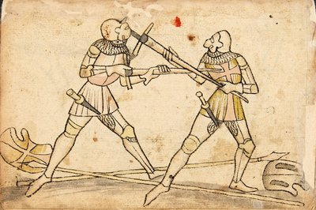
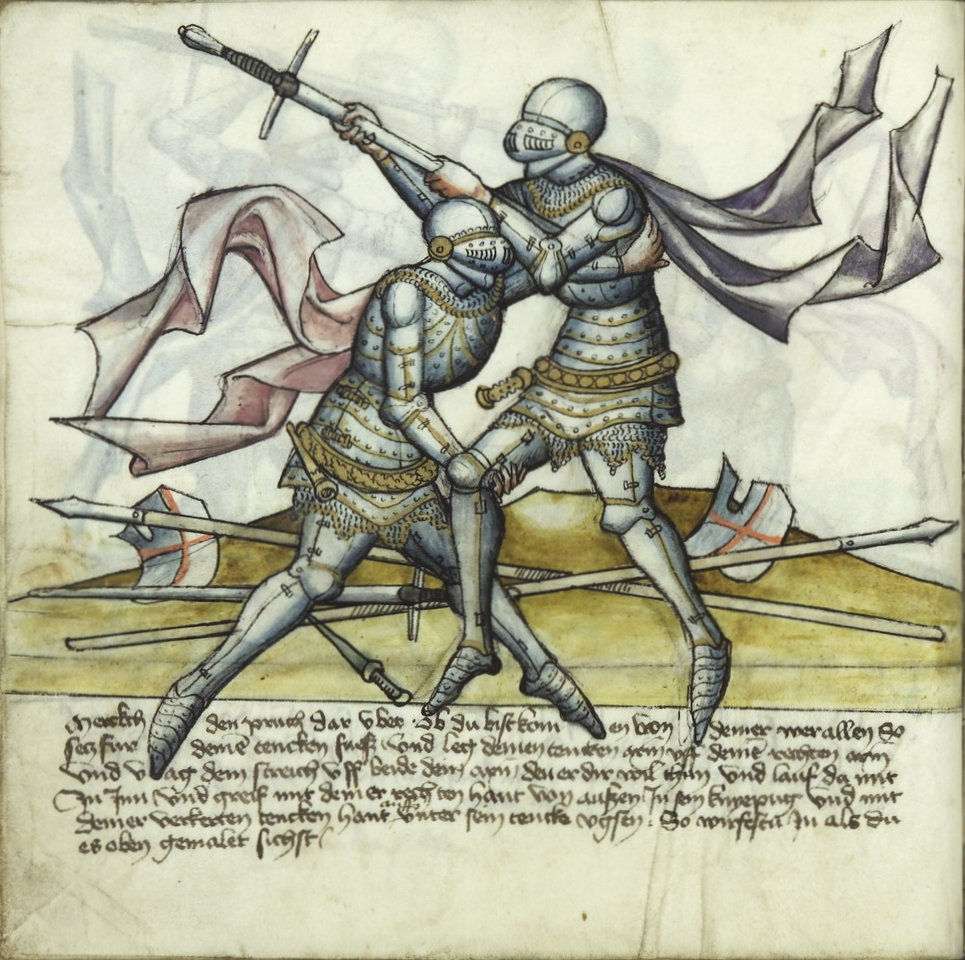

#+TITLE: ascii-armor
#+SUBTITLE: Binary-in-Text Encoding Validation Suite
#+AUTHOR: aygp-dr
#+OPTIONS: toc:2 num:nil ^:nil

[[https://github.com/aygp-dr/ascii-armor/actions][https://img.shields.io/badge/tests-passing-brightgreen.svg]]
[[https://www.freebsd.org/][https://img.shields.io/badge/FreeBSD-14.x-red.svg]]
[[https://orgmode.org/][https://img.shields.io/badge/org--mode-literate-blue.svg]]
[[https://github.com/aygp-dr/ascii-armor/blob/main/LICENSE][https://img.shields.io/badge/license-MIT-green.svg]]

* Overview

A validation suite for binary-in-text encoding patterns, from uuencode (1980)
to org-mode babel blocks (2026). Every encoding claim is an executable
round-trip test.

#+ATTR_ORG: :width 400

/Codex Wallerstein (c. 1470) — the Mordhau technique. Binary data, like a
sword, must sometimes be disguised to pass through hostile channels./

* The Problem

#+begin_quote
*Foundational Axiom*: A binary artifact must survive transit through a
channel that only tolerates text.
#+end_quote

Every encoding system solves the same constraint:
- 7-bit SMTP channels reject 8-bit bytes
- Text editors corrupt binary data
- Patch utilities expect printable ASCII
- Email headers have strict character limits

The solutions all converge on the same structure:

#+begin_src text
┌─────────────────────────────────────────┐
│  HEADER   name / type / encoding hint   │
│  PAYLOAD  ascii-safe encoded bytes      │
│  FOOTER   end marker / checksum         │
└─────────────────────────────────────────┘
#+end_src

* Encoding Lineage

| Year | Format        | Channel Constraint          | Overhead |
|------+---------------+-----------------------------+----------|
| 1980 | uuencode      | UUCP / 7-bit email          | ~37%     |
| 1983 | BinHex        | Mac resource forks          | ~35%     |
| 1987 | PEM/Base64    | Privacy-Enhanced Mail       | ~33%     |
| 1989 | XBM/XPM       | X11 icons/cursors (C source)| ~400%    |
| 1990 | X-Face        | Pine/Mutt/Gnus email faces  | custom   |
| 1990 | Ascii85       | PostScript/PDF              | ~25%     |
| 1992 | MIME Base64   | RFC 2045 email              | ~33%     |
| 1998 | data: URI     | RFC 2397 web embedding      | ~33%     |
| 2005 | Git binary    | Patch files                 | ~25%     |
| 2018 | org-mode      | Literate programming        | ~33%     |

** Audio/Radio Variants (same pattern, different channel)

| Year | Format           | Channel Constraint              | Notes                    |
|------+------------------+---------------------------------+--------------------------|
| 1976 | Kansas City Std  | Cassette tape (audio)           | 1200/2400 Hz FSK         |
| 1980 | BASICODE         | Radio broadcast (Netherlands)   | NOS/BBC/WDR/DDR          |
| 1978 | NOAA APT         | VHF radio (137 MHz)             | Weather satellite images |
| 2020 | LoRa/Meshtastic  | Sub-GHz radio (900 MHz)         | Text over mesh networks  |
| 2024 | NASA DSOC        | Laser (1550nm optical)          | Deep space optical comm  |

#+ATTR_ORG: :width 400

/Gladiatoria (c. 1430) — armored combat. Like knights donning armor,
binary data dons ASCII encoding to survive hostile text channels./

* What This Builds

- =spec.org= — Literate test suite (the spec /is/ the tests)
- =bin/check-prereqs.sh= — Tool availability check
- =bin/test-*.sh= — Round-trip tests for each encoding
- =elisp/display-helpers.el= — Org-mode inline image support
- =Makefile= — Tangle and test runner

* Quick Start

#+begin_src bash
# Clone
git clone https://github.com/aygp-dr/ascii-armor.git
cd ascii-armor

# Check prerequisites
make prereq

# Generate fixtures and run tests
make test

# Or execute the entire spec in Emacs
make test-org
#+end_src

* FreeBSD Requirements

Base system (already installed):
- =uuencode= / =uudecode=
- =b64encode= / =b64decode=
- =xxd=

Packages:
#+begin_src bash
pkg install git              # Required
pkg install sharutils        # Optional: GNU shar
pkg install ImageMagick7     # Optional: XBM/XPM conversion
#+end_src

See [[file:INSTALL-FREEBSD.md][INSTALL-FREEBSD.md]] for details.

* Methodology

** Spec is the Test Suite

Every =#+begin_src= block in =spec.org= is executable via =C-c C-c=.
If it cannot be executed, it is marked =:eval no=.

** Round-Trip Acceptance

For each encoding, the test is:
#+begin_src text
encode(decode(encode(x))) == encode(x)
#+end_src

Partial coverage (encode only) is not sufficient.

** Tool Detection First

Every shell block verifies tools are on PATH before use.
Missing tools produce structured JSON errors, not silent failures.

** Conjectures (CPRR)

Open hypotheses are tracked and testable:

| ID    | Hypothesis                              | Refutation            |
|-------+-----------------------------------------+-----------------------|
| C-001 | All required tools in FreeBSD 14 base   | check-prereqs exits 2 |
| C-003 | uuencode overhead ~37%                  | measured < 35%        |
| C-009 | Ascii85 overhead ~25%                   | measured > 27%        |
| C-011 | compface not in FreeBSD ports           | pkg install succeeds  |

* Project Structure

#+begin_src text
ascii-armor/
├── spec.org              # Literate test suite (source of truth)
├── CLAUDE.md             # Agent instructions
├── Makefile              # Build/test runner
├── INSTALL-FREEBSD.md    # Package installation guide
├── bin/
│   ├── check-prereqs.sh  # Tool availability check
│   ├── test-uuencode.sh  # uuencode round-trip
│   ├── test-b64encode.sh # base64 round-trip
│   └── ...
├── elisp/
│   └── display-helpers.el
├── resources/
│   ├── codex-wallerstein-107v.jpg
│   ├── gladiatoria-kk5013-28v.jpg
│   └── SOURCES.md
└── archive/
    └── spec-v1-*.org     # Previous spec versions
#+end_src

* References

- [[https://en.wikipedia.org/wiki/Uuencoding][uuencode (Wikipedia)]]
- [[https://www.rfc-editor.org/rfc/rfc2045][RFC 2045 (MIME)]]
- [[https://www.rfc-editor.org/rfc/rfc2397][RFC 2397 (data URI)]]
- [[https://en.wikipedia.org/wiki/X_BitMap][XBM (Wikipedia)]]
- [[https://en.wikipedia.org/wiki/Ascii85][Ascii85 (Wikipedia)]]
- [[https://orgmode.org/manual/Working-with-Source-Code.html][Org Babel Manual]]
- [[https://en.wikipedia.org/wiki/Kansas_City_standard][Kansas City Standard (Wikipedia)]]
- [[https://en.wikipedia.org/wiki/BASICODE][BASICODE (Wikipedia)]]
- [[https://www.rtl-sdr.com/rtl-sdr-tutorial-receiving-noaa-weather-satellite-images/][NOAA APT Reception (RTL-SDR)]]

* License

MIT

* Image Credits

Medieval fencing manuscripts from Wikimedia Commons (public domain):
- Codex Wallerstein (c. 1470) — Universitätsbibliothek Augsburg
- Gladiatoria Ms. KK5013 (c. 1430) — Kunsthistorisches Museum Vienna
